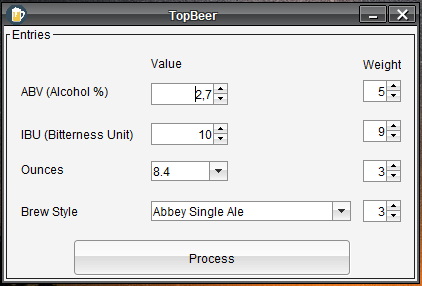
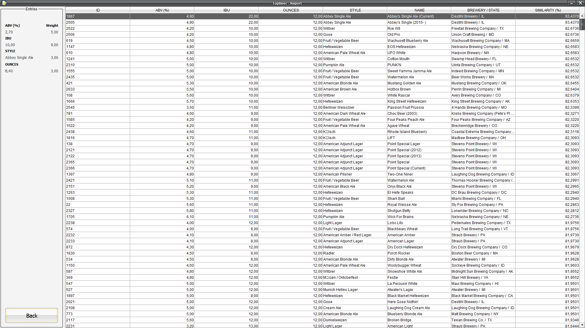

## TopBeer
Implementação em Java para um sistema de RBC (raciocínio baseado em casos) para recomendação de cervejas artesanais produzidas nos EUA.

- base de casos utilizados: https://www.kaggle.com/nickhould/craft-cans
- LookAndFeel: http://www.jtattoo.net

Aplicação:

